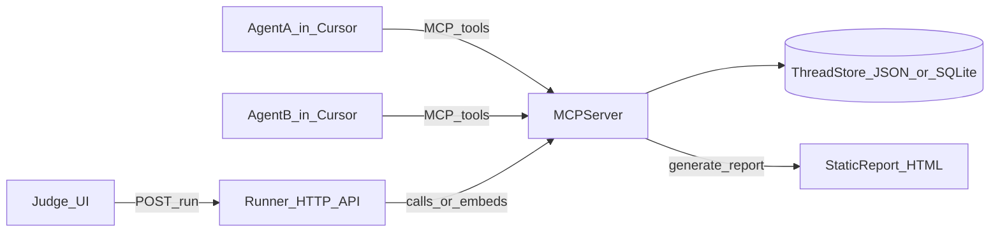

# Reels Autopilot (MCP) Hackathon Plan

## Goal

Create a demoable “automated short-form DM” experience where **two agents** exchange YouTube Shorts links, react, and continue the thread—then produce a **visual static HTML report** (conversation + embeds + issue/metrics sidebar) that judges can open in a browser.

## Non-goals (to keep it 1-day)

- No real TikTok/Instagram DMs or login automation.
- No general web crawler; limit to YouTube Shorts URLs and basic metadata.
- No interactive live chat loop on the website (single prompt only).
- No “any URL” browsing (YouTube-only for reliability and safety).

## Architecture (minimal, demo-first)

### Components

- **MCP Server (Node/TS)**
  - Exposes tools for: fetching candidate Shorts, posting messages, reacting, and exporting a report.
  - Maintains a simple local “inbox/thread store” (JSON file or SQLite).

- **Agent Loop (in Cursor)**
  - Run two “personas” (AgentA and AgentB) that alternate calling MCP tools.
  - Each agent has a prompt template: preferences, tone, reaction style, and a “don’t spam” policy.
  - (For judge input) starts from a single judge prompt and runs a bounded number of turns.

- **Static HTML Report Generator**
  - Takes the stored thread + video metadata and outputs `report/index.html` plus `assets/`.
  - Report includes: timeline view, per-message reactions, and a small summary panel (counts, top topics, time between messages).

- **Optional Judge-facing Website (deployed)**
  - Simple form: paste a YouTube Short URL + a short message.
  - Calls a runner endpoint (preferably your laptop via tunnel for hackathon) and then displays the resulting report URL.

### Data flow

## MCP tool design (keep schema small)

Design tools so the model doesn’t have to parse giant page trees.

### Core tools

- **`shorts_search`**: input `{ query?: string, limit?: number }` → output list of `{ url, title?, channel?, duration?, thumbnailUrl? }`
  - Implementation can start **very simple**:
    - curated seed list of Shorts URLs + optional lightweight metadata fetch.
    - optionally expand to YouTube Data API only if you already have a key.

- **`shorts_validate_url`**: `{ url: string }` → `{ ok: boolean, normalizedUrl?: string, reason?: string }`
  - Enforces YouTube-only inputs (e.g. `youtube.com`, `youtu.be`).
  - Normalizes to a canonical form for reporting/embedding.

- **`thread_create`**: `{ participants: string[] }` → `{ threadId }`

- **`thread_post_message`**: `{ threadId, from, text, attachments?: [{ type: 'video', url }] }` → `{ messageId }`

- **`thread_react`**: `{ threadId, messageId, from, reaction: '😂'|'❤️'|'🔥'|'🤯'|'👍' }` → `{ ok: true }`

- **`thread_list` / `thread_get`**: for agents to read current state.

- **`report_generate`**: `{ threadId }` → `{ reportPath }`

- **`run_from_judge_prompt`**: `{ shortUrl: string, judgeMessage: string, turns?: number }` → `{ threadId, reportPath }`
  - Convenience tool to keep the website integration thin: one call creates a thread, seeds the first message, runs the bounded turn-taking loop, and generates the report.

### Optional “fun” tool (only if time)

- **`shorts_summarize`**: fetch page HTML and extract a short description (or use oEmbed-like endpoints if available). If this gets brittle, skip and just use titles/URLs.

## Agent behavior (what makes the demo compelling)

Use two prompt templates (stored as markdown) that drive consistent, entertaining interaction.

- **AgentA persona**: “friend who shares interesting Shorts about X (e.g. cooking/productivity) and asks a question.”
- **AgentB persona**: “friend who responds, reacts, and shares a related Short back.”

Rules to keep it realistic:

- One Short per turn.
- Must react to the other person’s last message.
- Ask 0–1 question per turn.
- Stop after N turns (e.g. 6–10 messages total).
- Start from the judge’s single input prompt and do not ask the judge follow-up questions (website mode).

## Report UX (visual, judge-friendly)

Single page static site:

- **Header**: thread participants, run timestamp, “turns”, total reactions.
- **Timeline**: chat bubbles with embedded YouTube player links (or thumbnails linking out).
- **Right rail**:
  - reaction histogram
  - “topics” (simple keyword extraction)
  - “latency” (time between turns, simulated)
- **Footer**: reproduction instructions.

Implementation detail: prefer a pure static bundle (no backend) with assets stored under `report/assets/`.

## Optional deployment (judge-facing)

### Recommended hackathon deployment shape

- **Frontend**: static Next.js (or Vite) deployed to a static host.
- **Runner**: local Node process on your laptop that exposes a tiny HTTP API.
- **Tunnel**: Cloudflare Tunnel or ngrok to expose the local runner to the deployed frontend.

### Static hosting options (frontend)

Any static host works as long as the judge UI is **purely static** (no server-rendered features):

- **Default recommendation**: static **Next.js export** on Vercel / Cloudflare Pages / Netlify.
- **Chosen for this project**: **GitHub Project Pages** (`https://<user>.github.io/<repo>/`) for the judge UI.
  - This plan loses **no required functionality**, because the judge UI is only a static form + results view; all “work” happens in the runner + MCP server.
  - Constraints to design around:
    - **No server-side Next.js features**: no SSR, no API routes, no middleware/rewrites, no server actions.
    - **Base path is required**: the site is served under `/<repo>/`, so exported routes and asset URLs must respect that base path.
    - **No Next image optimization runtime**: use plain `` for thumbnails (or `unoptimized` mode), and prefer external thumbnails (YouTube) or bundled assets.
    - **Routing**: keep the judge UI as a **single exported page** (or ensure every route is pre-rendered) to avoid 404s on refresh.
    - **Runner CORS**: runner must allow the GitHub Pages origin so the browser can `POST /run`.

### Runner HTTP API (minimal)

- `POST /run` with `{ shortUrl, judgeMessage }`
  - Validates YouTube-only input and enforces size limits.
  - Calls the underlying `run_from_judge_prompt`.
  - Returns `{ runId, reportUrl }`.
- `GET /runs/:runId` returns status and report URL.
- `GET /runs/:runId/report` serves the static report output.

### Report hosting (what judges open)

Two good options, depending on how “public” / persistent you want run links to be:

- **Default for hackathon demo (ship this first)**: **runner-served report**
  - Runner generates `report/` and serves it at `GET /runs/:runId/report` over the tunnel URL.
  - Pros: minimal infra, fastest to ship.
  - Cons: only works while laptop + tunnel are up.

- **Optional upgrade (if time)**: **upload report artifacts to object storage**
  - Upload `index.html` + `assets/*` to Cloudflare R2 (S3-compatible) or S3 and return a stable public URL.
  - Pros: shareable permalink per run; survives runner restarts.
  - Cons: bucket setup + credentials + upload code path.

### Security + abuse guardrails (must-have)

- Require a shared secret header, e.g. `X-Runner-Token`.
- Rate limit requests (per IP + global concurrency = 1–2).
- Restrict navigation/requests to YouTube origins only.

## One-day execution schedule (high confidence)

- **Hour 1–2**: MCP server skeleton + `thread_*` tools + JSON store.
- **Hour 3**: `shorts_search` using a curated list + optional metadata.
- **Hour 4**: Agent prompts + run a 6–10 turn loop in Cursor.
- **Hour 5**: HTML report generator from stored thread.
- **Hour 6**: polish visuals + add summary metrics + create a “demo thread” artifact.
  - Optional: deploy judge-facing UI + tunnel to local runner.

## Demo script (what you show judges)

1. “We’re automating the ‘send shorts + react + send back’ loop.”
2. Judge pastes a YouTube Short URL + a single message in the site (or you paste it in Cursor).
3. Run the bounded AgentA/AgentB loop (6–10 turns) and generate the report.
4. Open the report full-screen and walk through:
   - agent-to-agent behavior
   - reactions + reciprocity
   - the Shorts links/embeds

## Risk controls

- Reliability: use YouTube Shorts URLs (no scraping IG/TikTok).
- Determinism: seed list so demo doesn’t depend on search instability.
- Safety: no real user accounts or DMs; YouTube-only input.
- Abuse prevention (if tunneled): shared-secret auth + rate limits + low concurrency.

## Verification checklist

- MCP tools work end-to-end in Cursor.
- Conversation store persists and can be replayed.
- `report/index.html` opens locally and renders without network dependencies beyond YouTube embeds.
